# All Points ATL — Operations Intelligence Demo

AI-powered operations assistant for a 3PL warehouse, built on [Arcade.dev](https://arcade.dev) MCP Gateway + Claude.

Talk to your logistics data in plain English. Get answers, analysis, and real artifacts — emails sent, Slack alerts posted, QBR decks built — all from a single conversation.

## What This Is

A sandbox demo environment with realistic 3PL data across 8 clients, 200+ shipments, 35 chargebacks, 150+ emails, and 100+ orders. The data is fake. The actions are real — emails land in your actual inbox, Slack messages post to your real channels, and slide decks appear in your Google Drive.

**6 operational domains. 29 MCP tools. One conversation.**

| Domain | What It Does | Tools |
|--------|-------------|-------|
| Carrier Exceptions | Detect delayed/lost/damaged shipments, track packages | 5 |
| Email Triage | Read and classify inbound customer emails | 4 |
| Profitability | Analyze revenue vs. labor cost by client | 5 |
| Rate Shopping | Compare carrier rates across open orders | 5 |
| Chargeback Defense | Review retailer compliance violations, gather evidence | 5 |
| LTL Freight | Quote and compare less-than-truckload carriers | 5 |

## Quick Start

### For You (deploy the demo)

```bash
# 1. Install dependencies
pip3 install faker
uv tool install arcade-mcp

# 2. Generate the database
python3 setup_database.py

# 3. Deploy all 6 MCP servers to Arcade Cloud
arcade login
./deploy.sh

# 4. Create a Gateway in the Arcade Dashboard (see SETUP.md)
```

### For the Prospect (use the demo)

1. Open the chatbot URL
2. Enter your email
3. Start chatting

No accounts. No setup. No subscriptions.

See [SETUP.md](SETUP.md) for full deployment instructions.

## Demo Scenarios

See [demo_scenarios.md](demo_scenarios.md) for 7 ready-to-run conversation starters:

1. **Monday Morning Triage** — cross-domain operations briefing
2. **Chargeback Sprint** — deadline-driven dispute workflow → email sent
3. **Client QBR Deck** — profitability analysis → Google Slides delivered
4. **Rate Shopping Batch** — 80+ orders compared → cost vs. quality tradeoffs
5. **Exception Escalation** — customer complaint → investigation → response sent
6. **LTL Cost Comparison** — freight carrier analysis by lane
7. **Cross-Client Health Check** — all 8 clients scored and ranked

## Architecture

```
┌──────────────────────────────────────────────────────┐
│          Hosted Chatbot (Chainlit + Claude API)       │
│          https://allpoints-demo.up.railway.app        │
│                                                      │
│   Prospect opens URL → enters email → starts chatting │
└─────────────────────────┬────────────────────────────┘
                          │
              ┌───────────┴───────────┐
              │                       │
              ▼                       ▼
┌──────────────────────┐  ┌───────────────────────────┐
│   Anthropic API      │  │   Arcade Gateway          │
│   (Claude LLM)       │  │   (single URL)            │
│                      │  ├─────────────┬─────────────┤
│   System prompt      │  │ MCP Servers │ OAuth Tools │
│   loaded from        │  │             │             │
│   project config     │  │ • Carrier   │ • Gmail     │
│                      │  │ • Email     │ • Slides    │
└──────────────────────┘  │ • Profit    │ • Slack     │
                          │ • Rates     │             │
                          │ • Chargeback│             │
                          │ • LTL       │             │
                          ├──────┬──────┴─────────────┘
                                 │
                                 ▼
                          ┌──────────────┐
                          │ SQLite DB    │
                          │ (24 tables)  │
                          │ Arcade Cloud │
                          └──────────────┘
```

**Left side = fake data** (proxy for the prospect's real operational systems).
**Right side = real tools** (prospect's actual Gmail, Slack, Google Drive via per-user OAuth).

The prospect opens one URL. No accounts, no connectors, no configuration. The chatbot bridges Claude's intelligence with the Arcade Gateway, routing tool calls through the prospect's authenticated session.

## Data Model

8 clients, each with products, shipments, orders, invoices, labor entries, and compliance data. All dates are relative to today so the data always feels current.

```mermaid
erDiagram
    clients ||--o{ contacts : has
    clients ||--o{ addresses : has
    clients ||--o{ products : has
    clients ||--o{ shipments : ships
    clients ||--o{ orders : receives
    clients ||--o{ invoices : billed
    clients ||--o{ labor_entries : incurs
    clients ||--o{ chargebacks : charged
    clients ||--o{ ltl_quotes : quotes
    clients ||--o{ inventory : stocks
    clients ||--o{ receiving_records : receives_goods

    carriers ||--o{ shipments : delivers
    carriers ||--o{ rates : prices
    carriers ||--o{ chargebacks : involved
    carriers ||--o{ ltl_quotes : quotes

    shipments ||--o{ shipment_items : contains
    shipments ||--o{ exceptions : flags
    shipments }o--|| contacts : ships_to
    shipments }o--|| addresses : origin
    shipments }o--|| addresses : destination

    orders ||--o{ order_items : contains
    orders ||--o{ rates : quoted
    orders ||--o{ labels : labeled
    orders }o--|| contacts : ships_to
    orders }o--|| addresses : destination

    invoices ||--o{ invoice_line_items : lines
    labor_entries }o--|| employees : worked_by

    retailers ||--o{ chargebacks : issues
    chargebacks ||--o{ evidence_files : supports
    chargebacks ||--o{ disputes : contested

    ltl_quotes ||--o{ ltl_bookings : booked

    products ||--o{ shipment_items : shipped
    products ||--o{ order_items : ordered
    products ||--o{ inventory : stocked
    products ||--o{ receiving_items : received

    receiving_records ||--o{ receiving_items : contains
```



### Table Counts

| Table | Records | Domain |
|-------|---------|--------|
| clients | 8 | Core |
| carriers | 9 | Core |
| products | 48 | Core |
| employees | 15 | Core |
| contacts | 56 | Core |
| addresses | 82 | Core |
| shipments | 200+ | Carrier Exceptions |
| exceptions | 60+ | Carrier Exceptions |
| emails | 150+ | Email Triage |
| orders | 120+ | Rate Shopping |
| rates | 400+ | Rate Shopping |
| chargebacks | 35 | Chargeback Defense |
| invoices | 40+ | Profitability |
| labor_entries | 400+ | Profitability |
| ltl_quotes | 275 | LTL Automation |
| inventory | 48 | Inventory |
| receiving_records | 40 | Receiving |

## File Structure

```
All_Points_Agents/
├── app/                             # Hosted chatbot (prospect-facing)
│   ├── main.py                      # Chainlit chat app + tool calling loop
│   ├── gateway.py                   # Arcade Gateway MCP client
│   ├── config.py                    # Settings (env vars)
│   ├── chainlit.md                  # Welcome screen
│   ├── requirements.txt             # Chatbot dependencies
│   └── Procfile                     # Railway deployment
│
├── shared/                          # Database + utilities
│   ├── database/
│   │   ├── schema.sql               # 24 tables with foreign keys
│   │   ├── seed_data.py             # Faker-based deterministic generator
│   │   └── connection.py            # Thread-safe SQLite helper
│   ├── formatters.py                # JSON / CSV / Markdown output
│   └── constants.py                 # Violation codes, service types, enums
│
├── mcp_servers/                     # Single combined MCP server (29 tools)
│   └── allpoints_server.py          # All 6 domains in one server
│
├── claude_project_prompt.md         # System prompt (loaded by chatbot)
├── demo_scenarios.md                # 7 conversation starters for demos
├── deploy.sh                        # Deploy MCP servers to Arcade Cloud
├── setup_database.py                # One-command database init
├── SETUP.md                         # Full setup guide (your side)
├── DEPLOY.md                        # Hosting & deployment options
├── USAGE.md                         # Prospect-facing usage guide
└── requirements.txt                 # MCP server dependencies
```

## Docs

| Doc | Audience | What it covers |
|-----|----------|---------------|
| [SETUP.md](SETUP.md) | You (deployer) | Database, MCP server deploy, Gateway creation, chatbot config |
| [DEPLOY.md](DEPLOY.md) | You (deployer) | Railway/Render/Fly.io hosting, costs, managing the deployment |
| [USAGE.md](USAGE.md) | Prospect | How to use the chatbot, example prompts, OAuth flow, privacy |
| [demo_scenarios.md](demo_scenarios.md) | You (on sales calls) | 7 copy-paste conversation starters for live demos |

## Built With

- [Arcade.dev](https://arcade.dev) — MCP Gateway + OAuth integrations
- [Anthropic Claude API](https://docs.anthropic.com) — LLM with tool calling
- [Chainlit](https://chainlit.io) — Chat UI framework
- SQLite — embedded relational database
- [Faker](https://faker.readthedocs.io/) — deterministic seed data generation
